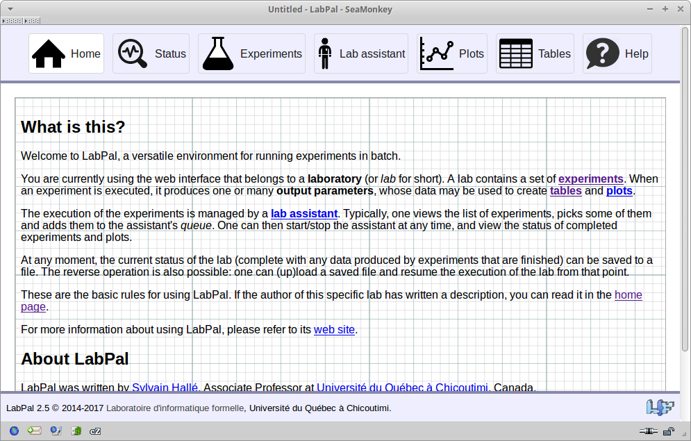
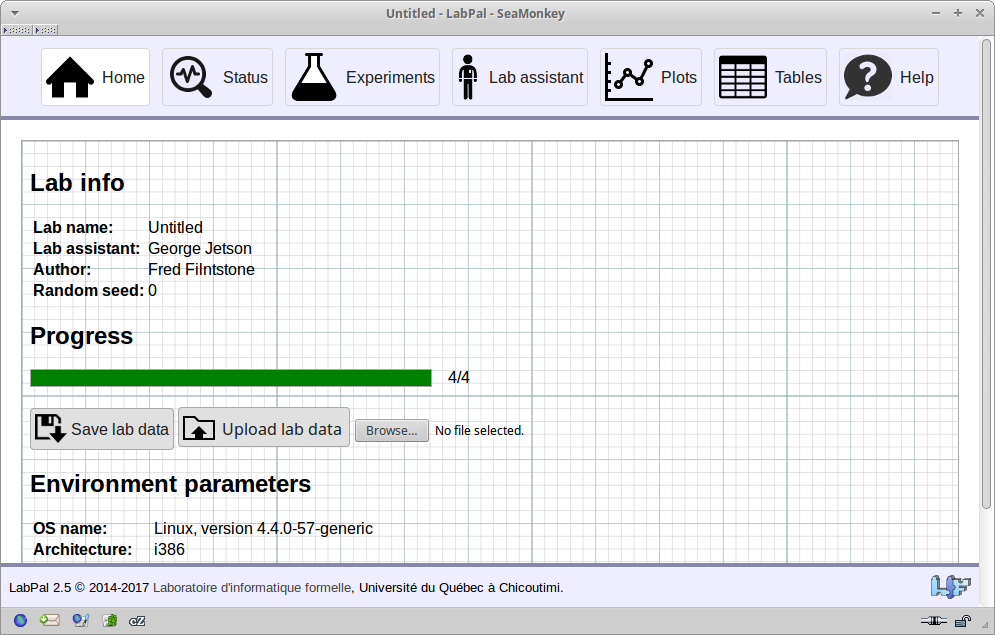
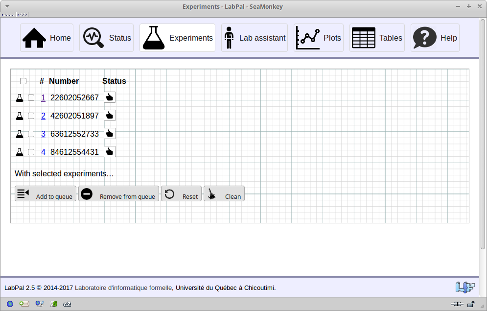
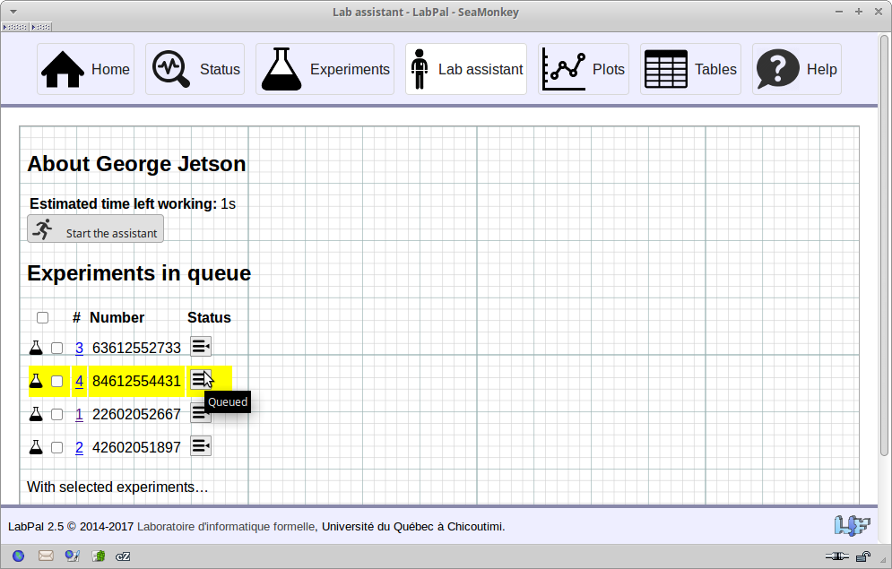

[User Manual](index.html)

# Using the web console

The preferred way of controlling the execution of experiments in LabPal is through its web console. If a laboratory has a `main` method, it will start in web mode by default when being executed.

In this section, you will learn the following features:

- [A video tutorial](#video)
- [Typical usage of the web console](#usage)
- [The elements of the web console](#elements)
- [Running a lab on a remote machine](#remote)
- [Changing the server port](#port)
- [Changing the color scheme](multiple-machines.html#color-scheme)

## <a name="usage">Typical usage of the web console</a>

A picture is worth a thousand words; here is a video showing the main features of the web console.

<iframe width="560" height="315" src="https://www.youtube.com/embed/5uL7i6SytyM" frameborder="0" allowfullscreen></iframe>

## <a name="usage">Typical usage of the web console</a>

If you are in a hurry, here is a quick run through on how to use the console to run experiments.

1. Go to the *Experiments* page by clicking on the button at the top of the page. This will display a list of experiments.
2. Select some experiments in the list by clicking on the corresponding checkbox.
3. Click on the "Add to assistant" button to queue these experiments
4. Go to the *Lab assistant* page by clicking on the button at the top of the page.
5. Click on the *Start* button. This will launch the execution of each experiment one after the other.
6. At any point, you can look at the results of the experiments that have run so far. You can do so by:
  - Going to the Plots or the Tables page and see the plots and tables created for this lab being updated in real time
  - Going back to the list of experiments, clicking on one of them and get the detailed description and data points that this experiment has generated
7. Once the assistant is done, you can export any of the plots and tables to a file, or the raw data points by using the *Export* button in the *Status* page.

## <a name="elements">The elements of the web console</a>

We will not look at the elements of the web console in more detail.

The web console is divided into seven pages, each of which gives details about specific parts of a lab.

### The *Home* page

As its name implies, the Home page is the first page that is displayed when opening the web console.

It displays two things:

- If no description for the lab has been defined by its author, the home page displays the same basic information as the Help page on how to use the lab.
- Otherwise, the page displays the text that has been written by the lab's author to describe this specific lab. When creating a lab, we recommend you use this space to give a description of the lab:
  - What does it do?
  - What are its expected conclusions?
  - What are the experiments in the lab?
  - What is the broader context in which these experiments have been designed (research paper, academic project, etc.)?

### The *Status* page

The status page displays global information about the lab. 

At the top of the page, you see the name given to the lab by its author, the name of the lab assistant associated to the lab, the name of the lab's author, etc.

Below is a progress bar that shows:
- How many experiments have successfully executed (green)
- How many experiments have failed (red)
- How many experiments have yet to be executed (grey)

When experiments are running, you can refresh the page and the bar will update accordingly.

Still below are two buttons that allow you to save and load the lab's state. This feature has [its own section](saving.html).

Finally, the bottom part of the page gives some more information about the environment in which the lab is running: name and version of the operating system, etc.

### The *Experiments* page

This page shows the list of all the experiments that have been incorporated into the lab.

Each experiment corresponds to one row in the list. Each experiment is given by the lab an internal unique number, which is displayed at the left. This number has no meaning, except for distinguishing experiments; you should not rely on this for anything else. Then, if the experiments have any input parameters, the value for each of these parameters is shown in the respective column.

The last column shows the status of the experiment. The status can either be:

- : the experiment is ready to run

- : the experiment is in the lab assistant's queue, waiting to be run

- : the experiment is currently running

- : the experiment must generate some [prerequisites](experiments.html#prerequisites) before it is ready to be run

- : the experiment has completed successfully

- : the experiment has failed (see [errors](experiments.html#errors))

A check box next to each experiment allows the user to select/unselect some of them, and apply a few operations in bulk. These operations are represented by the buttons at the very bottom of the page (you may have to scroll a bit to see them). You can:

- Add the selected experiments to the lab assistant's queue
- Reset the experiments to their initial state
- Clean the experiments. If an experiment generates resources or performs other operations before running, the *Clean* operation will clear them. See [experiment prerequisites](experiments.html#prerequisites).

### The *Experiment* page

Clicking on an experiment number brings a page that is specific to this experiment. This page shows:

- The name of the experiment
- The status of the experiment (running/failed/etc.), start time, etc.
- If the lab's author has entered a textual description for this experiment, it will be displayed there. See [metadata](metadata.html).
- If the experiment has failed, the corresponding error message will be displayed there.
- The experiment's input and output parameters, with their name and their value. If the lab's author has entered a textual description for these parameters, this description can be shown by hovering the mouse over the corresponding parameter name.

### The *Lab assistant* page

The lab assistant is responsible for managing the queue of experiments to be run. The contents of that queue are displayed in the *Lab assistant* page.

Currently, LabPal provides only one type of lab assistant, nicknamed "George Jetson". George executes the experiments sequentially, one by one, in the order in which they were added to the queue. (LabPal is planned to eventually provide other assistants that will run the experiments differently --for example using multiple threads.)

To start the assistant, click on the *Start* button at the top of the page. If the assistant is already running, the page will rather display a button that allows you to *Stop* the assistant. Stopping the assistant means that the experiment that is currently running will finish, but that no other experiment will be started. All the queued experiments remain in the queue, so that the assistant can be started again at a later time.

Otherwise, this page provides a few controls for managing the contents of the queue: one can select experiments and remove them from the queue, or completely clear the queue altogether. Modifications to the queue apply immediately, and they can be done even while the assistant is running.

### The *Plots* page

This is where the plots created from the lab's data are displayed.

- Clicking on a plot displays it as a full-sized PNG image in a separate window. You can save this file using your browser's *Save* menu.
- If the plot can be exported as a PDF file, clicking on the PDF button will launch the download of the plot.
- If the plot is generated by Gnuplot, an additional button allows you to download a stand-alone source Gnuplot file (see [plot libraries](plots.html#libraries)). You can save this file and run Gnuplot by yourself on any machine.
- Finally, a button at the top of the page allows you to download all the plots in a single, multi-page PDF file. This option requires [pdftk](https://www.pdflabs.com/tools/pdftk-the-pdf-toolkit/) to be installed on the machine; otherwise the button will not show.

This latter option turns out to be very convenient when writing research papers using LaTeX. With the `pdfpages` package, it is possible to display a specific page of a PDF file. When including a figure in the paper, one can hence write:

    \begin{figure}
    \includepdf[pages=2]{all-plots.pdf}
    \end{figure}

to include the second plot of the multi-page PDF (and similarly for the remaining figures). The advantage of doing this is that, if the lab is re-run, all the figures in the paper can be updated at the same time by simply replacing the old PDF file by the new one, which can save lots of time. (The plots are always included in the same order every time the PDF is generated.)

### The *Tables* page

Similarly to the plots page, this page shows the list of tables included in the lab. Clicking on a table displays its contents, and a few buttons allow each table to be exported in various formats (HTML, CSV, LaTeX).

The "Download all tables" button is similar to the "Download all plots" button. It creates a single file including all the tables exported as LaTeX `tabular` environments. However, each table is enclosed in a `savebox` environment with a different name (generally the table's name), like this:

<pre>
\newsavebox{\my_table_1}
\savebox{\my_table_1}{%
\begin{tabular}
(Table's contents)
\end{tabular}
}

\newsavebox{\my_table_2}
...
</pre>

One then simply has to `\include` the file at the beginning of the document, and to use one of the tables, write:

    \begin{table}
    \usebox{\my_table_1}
    \end{table}

The advantage of doing this is that, if the lab is re-run, all the tables in the paper can be updated at the same time by simply replacing the old file by the new one.

## <a name="remote">Running a lab on a remote machine</a>

Since the web console runs in a browser, experiments can be controlled from a remote machine. To this end, it suffices to start LabPal on some machine A, and to open the web console in a browser on some other machine B. In this case, you must replace `localhost` in the URL by the name (or IP address) of machine A.

This makes it possible to run experiments on a machine for which you do not have physical access, or that does not have a graphical environment installed (such as a server, or a headless virtual machine).

As an example, suppose you have a compiled lab, called `my-lab.jar`, that you wish to run on a machine with IP address 1.2.3.4. You can first open a terminal connection to the remote machine and upload `my-lab.jar` (or instruct it to download the file from some online location). You then start the lab on that machine as usual:

    $ java -jar my-lab.jar
    
    LabPal 2.9 - A versatile environment for running experiments
    (C) 2014-2017 Laboratoire d'informatique formelle
    Université du Québec à Chicoutimi, Canada
    Please visit http://localhost:21212/index to run this lab
    Hit Ctrl+C in this window to stop

However, at this point, you open your *local* web browser, and type the URL `http://1.2.3.4:21212/index`. This will open the web console of the remote instance of LabPal. From this point on, you can use LabPal as usual; however, all the experiments will actually run on machine 1.2.3.4, not on your local machine.

This process can be further extended, and you can setup multiple lab instances to automatically synchronize their results with your local machine, among other things. Please refer to the section [Running LabPal on multiple machines](multiple-machines.html).

## <a name="port">Changing the server port</a>

The default port for accessing the web console is 21212. If this port is not available on the machine where LabPal is run, this can be changed through the command-line switch `--port`. For example, to open LabPal on port 8080, you start it like this:

    $ java -jar my-lab.jar --port 8080

If LabPal (or some other process) is already using the intended port, the lab won't be able to start, and LabPal will issue a mesage like this:

    Cannot open port 8080; is another instance of LabPal already running?

Look out in particular when trying to use ports 80 or 8080, as these ports are frequently already in use by a web server that runs on the host machine (such as Apache or IIS).

Changing the port also means that you can run multiple instances of LabPal at the same time on the same machine, by giving them a different TCP port at startup.

## <a name="color-scheme">Changing the color scheme</a>

If you run multiple instances of LabPal at the same time, it may become confusing to control them side by side in multiple browser windows. The browser's address bar will show a different host/port for each lab instance, but it is possible to get a more explicit visual cue by changing the color of the web console. This is done by using the command-line option `--color-scheme`. For example, to start a web console by replacing the blueish GUI by a pink one, you start it like this:

    $ java -jar my-lab.jar --color-scheme 2

The value for `--color-scheme` determines what background color is used to display the interface. Any positive integer is accepted, although LabPal only has a handful of distinct color schemes to offer. This is why different numbers may lead to the same color.

<!-- :wrap=soft:mode=markdown: -->